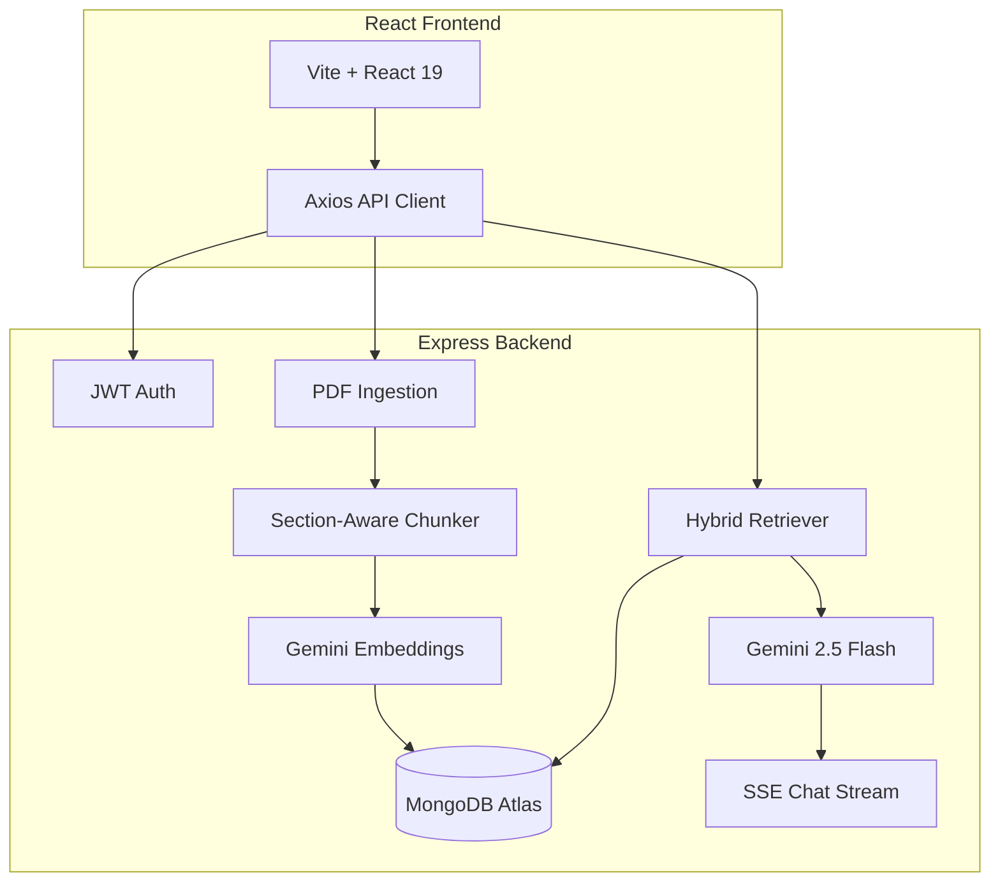

# InterviewPilot

**Full-stack RAG application for resume analysis, ATS matching, and AI-powered interview preparation.**

> Live Demo: _Deploy using [DEPLOYMENT.md](DEPLOYMENT.md) and add your URLs here_
>
> API Docs: `http://localhost:5000/api/docs` (Swagger UI)

InterviewPilot indexes PDF resumes as semantic vector embeddings and powers six AI features — resume analysis, ATS scoring, mock interviews, vector search, and streaming AI coaching with source citations.

---

## Architecture



### RAG Pipeline

1. **Ingest** — PDF upload → text extraction → section-aware chunking (Experience, Skills, Projects, etc.)
2. **Embed** — 3072-dim vectors via `gemini-embedding-2`, enriched with section/title metadata
3. **Retrieve** — Hybrid search: exact keyword match → Atlas `$vectorSearch` → keyword rerank fallback
4. **Generate** — Grounded prompts to Gemini with retrieved chunks; streaming SSE responses with citations

---

## Key Features

- JWT auth with httpOnly cookies and per-user vector isolation
- Section-aware resume chunking with enriched embedding context
- Hybrid retrieval (exact match + vector KNN + keyword reranking)
- Streaming AI Coach with source-attributed citations (section, score, snippet)
- Resume analysis, ATS keyword matching, mock interview generator
- Real dashboard metrics from API (no fake scores)
- OpenAPI docs at `/api/docs`
- Docker Compose for one-command local setup
- CI pipeline with Vitest + Supertest integration tests

---

## Tech Stack

| Layer | Technologies |
|-------|-------------|
| Frontend | React 19, Vite, Tailwind CSS v4, Zustand, React Router v7, Zod |
| Backend | Node.js, Express 5, Mongoose, LangChain JS |
| AI | Google Gemini (`gemini-2.5-flash`, `gemini-embedding-2`) |
| Database | MongoDB Atlas with Vector Search |
| DevOps | Docker, GitHub Actions CI, Vitest, Supertest |

---

## Quick Start (Docker)

```bash
cp backend/.env.example backend/.env
# Edit backend/.env with your MongoDB Atlas URI and Gemini API key

docker compose up --build
```

- Frontend: http://localhost:5173
- Backend: http://localhost:5000
- API Docs: http://localhost:5000/api/docs

## Manual Setup

### Prerequisites

- Node.js 18+
- MongoDB Atlas cluster with vector search index (`vector_index` on `documentchunks`)

### Backend

```bash
cd backend
npm install
cp .env.example .env   # configure MONGO_URI, JWT_SECRET, GEMINI_API_KEY
npm run dev
```

### Frontend

```bash
cd frontend
npm install
cp .env.example .env
npm run dev
```

Open http://localhost:5173

---

## Environment Variables

**Backend** (`backend/.env`):

```env
PORT=5000
MONGO_URI=mongodb+srv://...
JWT_SECRET=your_secret
GEMINI_API_KEY=your_key
GEMINI_MODEL=gemini-2.5-flash
FRONTEND_URL=http://localhost:5173
```

**Frontend** (`frontend/.env`):

```env
VITE_API_URL=http://localhost:5000/api
```

---

## API Endpoints

| Method | Endpoint | Description |
|--------|----------|-------------|
| POST | `/api/auth/register` | Register user |
| POST | `/api/auth/login` | Login |
| GET | `/api/auth/me` | Current user |
| POST | `/api/documents/resume` | Upload PDF resume |
| GET | `/api/documents/resume/stats` | Dashboard stats & activity |
| POST | `/api/documents/jd` | Upload or paste job description |
| GET | `/api/documents/jd` | Saved JD metadata |
| DELETE | `/api/documents/jd` | Remove saved JD |
| POST | `/api/chat` | RAG chat (JSON response) |
| POST | `/api/chat/stream` | RAG chat (SSE streaming) |
| GET | `/api/chat/history` | Last 50 chat messages |
| DELETE | `/api/chat/history` | Clear chat thread |
| POST | `/api/analyze-resume` | AI resume analysis |
| POST | `/api/ats-score` | ATS keyword matching |
| POST | `/api/interview/questions` | Mock interview questions |
| POST | `/api/search` | Vector chunk search |
| GET | `/api/health` | Health check |
| GET | `/api/docs` | Swagger UI |

Full interactive docs available at `/api/docs` when the server is running.

---

## Testing

```bash
# Backend (17 integration tests)
cd backend && npm test

# Frontend (5 unit tests)
cd frontend && npm test
```

CI runs automatically on push/PR via GitHub Actions (`.github/workflows/ci.yml`).

### Vector search not working?

Run `cd backend && npm run verify:index`. If it fails, follow [docs/ATLAS_VECTOR_INDEX.md](docs/ATLAS_VECTOR_INDEX.md) to create the `vector_index` on your Atlas `documentchunks` collection.

### RAG Evaluation

Measure retrieval quality against a golden question set in `backend/evals/golden.json`:

```bash
cd backend
npm run eval
# Or target a specific user:
npm run eval -- <userId>
```

The script reports per-question pass/fail and overall `precision@5` (whether any top-5 chunk matches expected keywords or section). Run after uploading your resume so chunks exist in the database.

| Metric | Result |
|--------|--------|
| precision@5 | _Run `npm run eval` with your resume to fill in_ |

---

## Deployment

See [DEPLOYMENT.md](DEPLOYMENT.md) for step-by-step instructions to deploy on:

- **Frontend:** Vercel
- **Backend:** Render (via `render.yaml`)
- **Database:** MongoDB Atlas

---

## Design Decisions

**Why MongoDB Atlas over Pinecone?**
Single database for user data, document metadata, and vectors. Atlas Vector Search supports filtered KNN by `userId` for per-user isolation without a separate vector DB.

**Why hybrid retrieval?**
Exact keyword pre-search catches rare proper nouns (company names, project titles) that pure vector search may miss. Keyword reranking boosts chunks with query term overlap.

**Why section-aware chunking?**
Resume structure (Experience vs Skills vs Projects) improves retrieval precision. Enriched embedding text (`Section: X\nTitle: Y`) helps the model match intent to the right resume region.

---

## Project Structure

```
RAG/
├── backend/          # Express API + RAG pipeline
│   ├── controllers/  # Route handlers
│   ├── rag/          # Chunking, retrieval, prompts
│   ├── tests/        # Vitest + Supertest
│   └── app.js
├── frontend/         # React SPA
│   └── src/
├── docker-compose.yml
├── render.yaml       # Render deployment blueprint
└── DEPLOYMENT.md
```

---

## License

MIT
